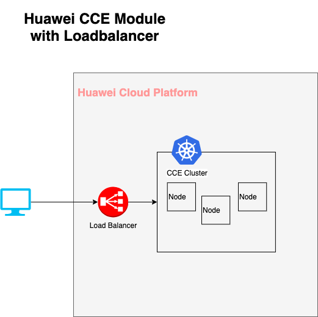

# Huawei Cloud CCE Terraform module

Terraform module which creates HuaweiCloud CCE (Kubernetes) resources
## Architecture Diagram



## External Documentation

Please note that we strive to provide a comprehensive suite of documentation for __*configuring and utilizing the module(s)*__ defined here, and that documentation regarding CCE (including CCE Node) and/or Kubernetes features, usage, etc. are better left up to their respective sources:

| Name | Type |
|------|------|
| [Kubernetes Documentation](https://kubernetes.io/docs/home) | Resource |
| [huaweicloud_cce_cluster.mycce](https://registry.terraform.io/providers/huaweicloud/huaweicloud/latest/docs/resources/cce_cluster) | Resource |
| [huaweicloud_cce_node.mynode](https://registry.terraform.io/providers/huaweicloud/huaweicloud/latest/docs/resources/cce_node) | Resource |
| [huaweicloud_compute_keypair.cce-node](https://registry.terraform.io/providers/huaweicloud/huaweicloud/latest/docs/resources/compute_keypair) | Resource |
| [huaweicloud_lb_loadbalancer.loadbalancer](https://registry.terraform.io/providers/huaweicloud/huaweicloud/latest/docs/resources/lb_loadbalancer) | Resource |
| [huaweicloud_networking_eip_associate.eip_1](https://registry.terraform.io/providers/huaweicloud/huaweicloud/latest/docs/resources/networking_eip_associate) | Resource |
| [huaweicloud_vpc_eip.eip-lb](https://registry.terraform.io/providers/huaweicloud/huaweicloud/latest/docs/resources/vpc_eip) | Resource |
| [huaweicloud_availability_zones.myaz](https://registry.terraform.io/providers/huaweicloud/huaweicloud/latest/docs/data-sources/availability_zones) | Data Source |
| [huaweicloud_compute_flavors.flavors](https://registry.terraform.io/providers/huaweicloud/huaweicloud/latest/docs/data-sources/compute_flavors) | Data Source |
| [huaweicloud_vpc_subnet.subnet](https://registry.terraform.io/providers/huaweicloud/huaweicloud/latest/docs/data-sources/vpc_subnet) | Data Source |

## Available Features

## Usage

```hcl
module "cce-cluster" {
  source = "github.com/smu-chile/terraform-huawei-cce-module?ref=v1.0.3"

  cluster_name          = data.consul_keys.input.var.cluster_name
  cce_cluster_flavor_id = data.consul_keys.input.var.cce_cluster_flavor_id
  cce_node_data_size    = data.consul_keys.input.var.cce_node_data_size
  cce_node_flavor_id    = data.consul_keys.input.var.cce_node_flavor_id
  cce_node_root_size    = data.consul_keys.input.var.cce_node_root_size
  private_subnet_id     = data.consul_keys.input.var.private_subnet_id
  public_subnet_id      = data.consul_keys.input.var.public_subnet_id
  vpc_id                = data.consul_keys.input.var.vpc_id
  cluster_version       = data.consul_keys.input.var.cluster_version
  node_count            = data.consul_keys.input.var.cce_node_count
  volumetype            = data.consul_keys.input.var.cce_node_volumetype
  public_key            = data.consul_keys.input.var.bastion_ssh_public_key
  default_tags          = jsondecode(data.consul_keys.input.var.default_tags)
  lb_bandwidth_size     = tonumber(data.consul_keys.input.var.lb_bandwidth_size)
  lb_share_type         = data.consul_keys.input.var.lb_share_type
  lb_charge_mode        = data.consul_keys.input.var.lb_charge_mode
  lb_max_connections    = tonumber(data.consul_keys.input.var.lb_max_connections)
}
```

## Examples

## Contributing

We are grateful to the community for contributing bugfixes and improvements! Please see below to learn how you can take part.
## Requirements

| Name | Version |
|------|---------|
| <a name="requirement_terraform"></a> [terraform](#requirement\_terraform) | ~> 1.2.0 |
| <a name="requirement_huaweicloud"></a> [huaweicloud](#requirement\_huaweicloud) | ~> 1.26.1 |

## Providers

| Name | Version |
|------|---------|
| <a name="provider_huaweicloud"></a> [huaweicloud](#provider\_huaweicloud) | ~> 1.26.1 |

## Resources

## Inputs

| Name | Description | Type | Default | Required |
|------|-------------|------|---------|:--------:|
| <a name="input_cce_cluster_flavor_id"></a> [cce\_cluster\_flavor\_id](#input\_cce\_cluster\_flavor\_id) | Specifies the cluster specifications. Changing this parameter will create a new cluster resource. | `string` | N/A | no |
| <a name="input_cce_node_data_size"></a> [cce\_node\_data\_size](#input\_cce\_node\_data\_size) | Partition Size Data | `string` | N/A | no |
| <a name="input_cce_node_flavor_id"></a> [cce\_node\_flavor\_id](#input\_cce\_node\_flavor\_id) | Huawei Instance flavor Id | `string` | N/A | no |
| <a name="input_cce_node_root_size"></a> [cce\_node\_root\_size](#input\_cce\_node\_root\_size) | Root partition size | `string` | N/A | no |
| <a name="input_cluster_name"></a> [cluster\_name](#input\_cluster\_name) | Cluster Name | `string` | N/A | yes |
| <a name="input_cluster_version"></a> [cluster\_version](#input\_cluster\_version) | Specifies the cluster version, defaults to the latest supported version. Changing this parameter will create a new cluster resource. | `string` | N/A | no |
| <a name="input_default_tags"></a> [default\_tags](#input\_default\_tags) | tags by default | `any` | N/A | yes |
| <a name="input_node_count"></a> [node\_count](#input\_node\_count) | Node Count | `number` | N/A| no |
| <a name="input_private_subnet_id"></a> [private\_subnet\_id](#input\_private\_subnet\_id) | Specifies the ID of the subnet used to create the node which should be configured with a *DNS address*. Changing this parameter will create a new cluster resource. | `string` | N/A | yes |
| <a name="input_public_key"></a> [public\_key](#input\_public\_key) | SSH Public Key | `string` | N/A | yes |
| <a name="input_public_subnet_id"></a> [public\_subnet\_id](#input\_public\_subnet\_id) | Network ID de subnet | `string` | N/A | yes |
| <a name="input_volumetype"></a> [volumetype](#input\_volumetype) | Volume Type, SATA o SSD | `string` | N/A | no |
| <a name="input_vpc_id"></a> [vpc\_id](#input\_vpc\_id) | Specifies the ID of the VPC used to create the node. Changing this parameter will create a new cluster resource. | `string` | N/A | yes |
| <a name="container_network_type"></a> [container\_network\_type](#input\_container\_network\_type) | Specifies the container network type. Changing this parameter will create a new cluster resource. Possible values: **overlay_l2**: An overlay_l2 network built for containers by using Open vSwitch(OVS), **vpc-router**: An vpc-router network built for containers by using ipvlan and custom VPC routes, **eni**: A Yangtse network built for CCE Turbo cluster. The container network deeply integrates the native ENI capability of VPC, uses the VPC CIDR block to allocate container addresses, and supports direct connections between ELB and containers to provide high performance. | `string` | N/A | no |
| <a name="authentication_mode"></a> [authentication\_mode](#input\_authentication\_mode) | Specifies the authentication mode of the cluster, possible values are **rbac** and **authenticating_proxy**. Defaults to **rbac**. Changing this parameter will create a new cluster resource. | `string` | N/A | no |
| <a name="kube_proxy_mode"></a> [kube\_proxy\_mode](#input\_kube\_proxy\_mode) | Specifies the service forwarding mode. Changing this parameter will create a new cluster resource. Two modes are available: **iptables**: Traditional kube-proxy uses iptables rules to implement service load balancing. In this mode, too many iptables rules will be generated when many services are deployed. In addition, non-incremental updates will cause a latency and even obvious performance issues in the case of heavy service traffic. **ipvs**: Optimized kube-proxy mode with higher throughput and faster speed. This mode supports incremental updates and can keep connections uninterrupted during service updates. It is suitable for large-sized clusters. | `string` | N/A | no |

## Outputs

| Name | Description |
|------|-------------|
| <a name="output_kubeconfig"></a> [kubeconfig](#output\_kubeconfig) | N/A |
| <a name="output_lb_id"></a> [lb\_id](#output\_lb\_id) | N/A |
| <a name="output_lb_public_ip"></a> [lb\_public\_ip](#output\_lb\_public\_ip) | N/A |
| <a name="output_lb_subnet_id"></a> [lb\_subnet\_id](#output\_lb\_subnet\_id) | N/A |